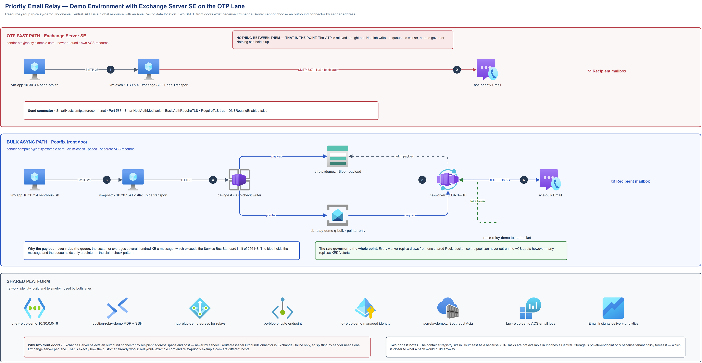

# Priority Email Relay on Azure

A working reference implementation of **priority routing and asynchronous buffering**
for high-volume outbound application email on Azure Communication Services (ACS).

The problem it solves: when one system sends both time-sensitive mail (OTPs, transaction
alerts) and bulk mail (statements, campaigns) through the same relay, the bulk traffic
can starve the time-sensitive traffic exactly when volume peaks. ACS has no priority
feature to switch on, so priority has to be built above it.

This repository contains the code and architecture from a lab that was built and tested
end to end, including the findings that only surface when you actually run it.



## The design in one paragraph

Two lanes, split at the SMTP front door by sender address:

- **Priority lane** — relayed straight to ACS. Never queued, never rate-limited, and it
  uses its own ACS resource in its own subscription so bulk congestion cannot reach it.
- **Bulk lane** — the message body is written to Blob Storage and only a *pointer* goes
  on a Service Bus queue (the claim-check pattern). Container Apps workers drain the
  queue, and every worker draws from one shared Redis token bucket so the whole pool
  paces itself against the ACS quota no matter how many replicas KEDA starts.

The bulk lane is buffered so that the priority lane never has to be.

## What is in here

| Path | What it is |
|---|---|
| `ingest/` | Claim-check writer. Accepts a message, stores the payload in Blob, enqueues the pointer. |
| `worker/` | Bulk sender. Dequeues, fetches the payload, paces against the shared token bucket, submits to ACS over HMAC-signed REST. |
| `postfix/` | Postfix pipe transport that routes bulk mail into the claim-check service. |
| `exchange/` | PowerShell for the optional Exchange Server SE variant, where Exchange replaces Postfix as the front door on the priority lane. |
| `diagram/` | Editable draw.io source and rendered PNG, built from the verified Azure icon set. |

## Findings worth knowing

These came out of building it, not from documentation. Several contradict what you would
reasonably assume.

**The ACS send quota is enforced per *subscription*, not per resource.** Two ACS resources
in one subscription share one quota pool. We proved this by flooding one resource until it
returned `429 PerSubscriptionPerHourLimitExceeded`, at which point a message sent through a
completely separate ACS resource in the same subscription was also rejected with
`450 4.5.127`. Separate resources give blast-radius isolation but **not** capacity
isolation. Only separate subscriptions do that.

**Rate-limiting a Service Bus consumer fights the message lock.** If the governor holds a
message longer than the queue's lock duration, the broker redelivers it — and if the first
attempt already sent the mail, that is a duplicate. `worker/app.py` addresses this with an
`AutoLockRenewer`, a small prefetch, and by deleting the payload blob *before* settling the
message so a redelivery can safely conclude the send already happened.

**Postfix cannot pace a fleet.** Its rate controls are local to each instance; there is no
built-in way for several Postfix hosts to share one rate budget. That is the whole reason
the shared Redis bucket exists.

**Exchange cannot route outbound by sender.** Send connector selection is by recipient
address space and cost. `RouteMessageOutboundConnector` is Exchange Online only. Splitting
lanes by sender therefore needs one Edge Transport server per lane.

**ACS Email logging covers SMTP submissions too.** Microsoft documents the REST path but
does not state whether SMTP submissions produce the same telemetry. They do — both appear
identically in `ACSEmailSendMailOperational` and `ACSEmailStatusUpdateOperational`.

## Deliberately not included

- No infrastructure-as-code. The lab was built by hand and the exact resource topology is
  specific to one tenant's policy constraints.
- No credentials, connection strings, subscription/tenant IDs or endpoints. Everything is
  read from environment variables at runtime.
- No customer material of any kind — no names, volumes, hostnames or architecture.
- The Exchange scripts assume media you must obtain yourself; none is included.

## Running it

Both container apps expect configuration from the environment:

```
BLOB_ACCOUNT_URL        https://<account>.blob.core.windows.net
SERVICEBUS_NAMESPACE    <namespace>.servicebus.windows.net
SERVICEBUS_QUEUE        q-bulk
ACS_ENDPOINT            https://<resource>.<geo>.communication.azure.com
ACS_ACCESS_KEY          (secret reference, never a literal)
SENDER_ADDRESS          campaign@<your verified domain>
REDIS_HOST              <cache>.<region>.redis.azure.net
REDIS_PORT              10000        # Azure Managed Redis; the retiring Cache used 6380
BULK_RATE_PER_MINUTE    5            # the reservation dial
LOCK_RENEW_SECONDS      600
PREFETCH_COUNT          3
```

Blob and Service Bus access use `DefaultAzureCredential`, so assign the managed identity
**Storage Blob Data Contributor** and **Azure Service Bus Data Owner** rather than using
keys.

## Status

Reference implementation from a proof of concept. It demonstrates the mechanism, not
production scale — it has not been load-tested, and the throughput and licensing questions
it raises are noted above rather than answered.

## Licence

MIT. See [LICENSE](LICENSE).
